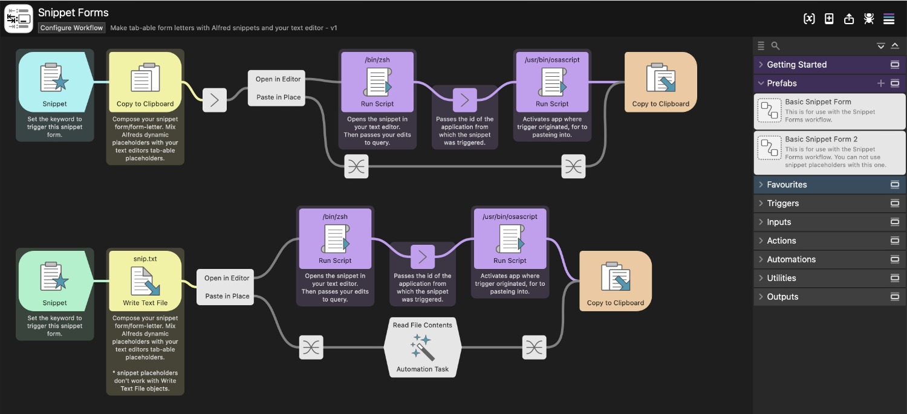
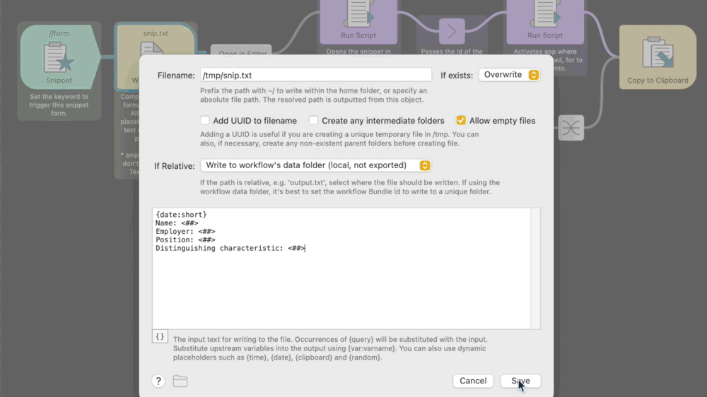
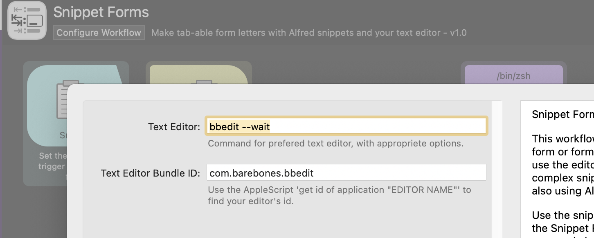

# Snippet Forms

This workflow contains templates for Snippet Forms. Snippet Forms open a form or form-letter in a specified text editor. Allowing you to use the editors native tab-able placeholders. You can then make complex snippets that can be tabbed through and fill in like a form.

Use the snippet trigger keyword anywhere they work. It will open the Snippet Form in your graphical text editor of choice. Edit, save and close the Snippet Form and it will expand inline where the keyword was triggered.

__There are two variables to configure in Configure Workflow.__ 

1. Text Editor {var:editor}. More specifically the command line utility for the editor. The editor must be configured to stop execution of the shell while in use. For example: bbedit --wait

2. Text Editor Bundle ID {var:editor_id}. The bundle id of your text editor.

	_Use the AppleScript: 'get id of application "BBEdit"' to find your editor's bundle id. Replace BBEdit with the name of your editor._
	

__There are also two objects to configure in the template workflows provided.__

1. The first object should be configured with the snippet trigger.

2. The second object should be configured with the text of the Snippet Form.
	
	Compose the Snippet Forms with Alfred dynamic placeholders and your text editors tab-able placeholders.

If you are expanding the Snippet Form in your choosen text editor it will not then open a second document in that editor. Instead it will expand the snippet in place.

I have two different templates for a Snippet Form. They do exactly the same thing; one uses Copy to Clipboard while the other uses Write Text File to hold the Snippet Form text. I think the latter is more elegant but the second can use snippet placeholders allowing you to mix and match your snippets. I can't say why Write Text File doesn't support them.

Either or both of these can be made into Prefabs for later use and safe keeping.

This has only been tested with BBEdit as it is my text editor of choice.
If you your editor doesn't have tab-able placeholders that can be represented in good old unicode text this won't work.
It will also not work if your editor doesn't have a command line tool with an option to wait for the shell.